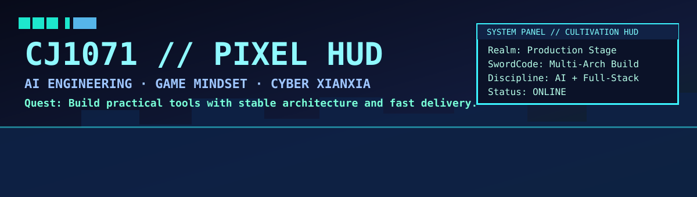
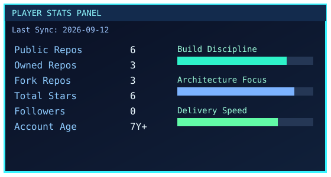
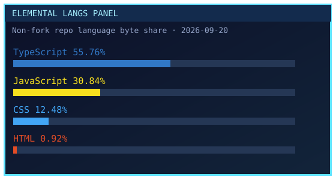

<div align="center">
  
</div>

<div align="center">
  <a href="https://github.com/cj1071?tab=repositories">Repo Hub</a> •
  <a href="https://github.com/cj1071?tab=stars">Star List</a> •
  <a href="https://github.com/cj1071?tab=overview&from=2024-12-01&to=2026-12-31">Activity</a>
</div>

## 角色状态 / Character Status

- 职业 / Class: `AI Engineer + Full-Stack Builder`
- 阵营 / Alignment: `Pixel × Game × Anime × Cyber Xianxia`
- 目标 / Objective: 做稳定、可观测、可持续交付的 AI 产品。

## 像素背包 / Pixel Inventory

```text
[Artifact] Architecture Compass  -> pragmatic, shippable, observable
[Artifact] Build Script Blade    -> automate first, then scale
[Artifact] Debug Mirror          -> data-driven diagnosis
[Artifact] Delivery Boots        -> fast iteration, steady quality
```

## 修炼面板 / Cultivation Dashboard

<div align="center">
  
  
</div>

## 当前任务线 / Current Questline

- 构建可落地的 AI 工作流 / Build reliable AI workflows for production.
- 保持系统可观测、可测试、可迭代 / Keep systems observable, testable, and easy to iterate.
- 交付真正解决问题的工具 / Ship tools that solve real daily work.

## 自有仓库 / Owned Repositories

<!-- OWNED_REPOS_START -->
| Repository | Tech | Stars | Description |
| --- | --- | ---: | --- |
| [NLStatus-Pro](https://github.com/cj1071/NLStatus-Pro) | TypeScript | 2 | - |
| [video-screenshot](https://github.com/cj1071/video-screenshot) | JavaScript | 1 | 这是一个Chrome扩展程序，可以自动截取网页上播放的视频画面，并保存到本地 |
| [cj1071](https://github.com/cj1071/cj1071) | JavaScript | 0 | GitHub profile README |
<!-- OWNED_REPOS_END -->

## Fork 收藏 / Forked Collection

<!-- FORKED_REPOS_START -->
| Repository | Tech | Stars | Why I Forked |
| --- | --- | ---: | --- |
| [MiniDialog](https://github.com/cj1071/MiniDialog) | - | 1 | 功能丰富、使用简单、灵活多样、体积轻巧的无任何第三方依赖的 JavaScript 对话框组件。 |
| [preserve-cd](https://github.com/cj1071/preserve-cd) | - | 1 | Game Preservation Project |
| [cloud-mail](https://github.com/cj1071/cloud-mail) | - | 0 | A Cloudflare-based email service  \| 基于 Cloudflare 的邮箱服务  \| Cloudflare Email 邮箱 Mail |
<!-- FORKED_REPOS_END -->