<table>
<tr>
<td width="50%" valign="top">

### 👋 Hello

热衷于用代码解决真实问题，专注于 IoT × AI × Cloud 的全链路实践。当前在做智能温室系统，从 MCU 固件、服务端 API 到微信小程序全栈交付。相信稳定、可观测、可持续交付的产品才是好产品。

</td>
<td width="50%" valign="top">

### 🧭 About Me

- 🔭 **Current** — IoT × AI × Cloud Deploy
- 🌱 **Stack** — Python · TypeScript · C · Docker
- 🏢 **Team** — [tewaiwu](https://github.com/tewaiwu)
- ☁️ **Infra** — 腾讯云 + 1Panel + CI/CD
- 💡 **Motto** — Build for real problems

</td>
</tr>
</table>

### 🛠️ Tech Stack

&nbsp;

<picture>
  <source media="(prefers-color-scheme: dark)" srcset="./profile-3d-contrib/profile-night-rainbow.svg" />
  <source media="(prefers-color-scheme: light)" srcset="./profile-3d-contrib/profile-gitblock.svg" />
  
</picture>

&nbsp;

<picture>
  <source media="(prefers-color-scheme: dark)" srcset="https://raw.githubusercontent.com/cj1071/cj1071/output/github-contribution-grid-snake-dark.svg" />
  <source media="(prefers-color-scheme: light)" srcset="https://raw.githubusercontent.com/cj1071/cj1071/output/github-contribution-grid-snake.svg" />
  
</picture>

<!--RECENT_ACTIVITY:start-->
- ⬆️ [cj1071/cj1071](https://github.com/cj1071/cj1071): Pushed 0 commits
- ⬆️ [cj1071/cj1071](https://github.com/cj1071/cj1071): Pushed 0 commits
- ⬆️ [cj1071/cj1071](https://github.com/cj1071/cj1071): Pushed 0 commits
- ⬆️ [cj1071/cj1071](https://github.com/cj1071/cj1071): Pushed 0 commits
- ⬆️ [cj1071/cj1071](https://github.com/cj1071/cj1071): Pushed 0 commits
<!--RECENT_ACTIVITY:end-->
