## 👋 Hi there, I'm Chenjie

## 🧭 About Me

| About Me | |
|---|---|
| 🔭 **Current** | IoT × AI × Cloud Deploy — 智能温室系统 |
| 🌱 **Stack** | Python · TypeScript · C · Docker · GitHub Actions |
| 🏢 **Team** | [tewaiwu](https://github.com/tewaiwu) — 多人协作项目组织 |
| ☁️ **Infra** | 腾讯云 + 1Panel + Docker CI/CD |
| 💡 **Motto** | 做稳定、可观测、可持续交付的产品 |

## 🤗 Welcome

## 🛠️ Tech Stack

`IoT` · `FastAPI` · `WeChat Mini Program` · `MCU GD32` · `SQLite` · `Supervisor`

## 🗺️ Project Map

| Category | Project | Tech | Description |
|----------|---------|------|-------------|
| 🌡️ IoT | [gh-server](https://github.com/tewaiwu/gh-server) | Python · FastAPI | 智能温室服务端：REST API + 静态前端 + Docker 部署 |
| 🔌 IoT | [gh-firmware](https://github.com/tewaiwu/gh-firmware) | C · GD32F30x | 设备端 MCU 固件：传感器采集 + 继电器控制 + 通信协议 |
| 📱 IoT | [gh-app](https://github.com/tewaiwu/gh-app) | JS · WeChat MP | 微信小程序：远程监控温室温湿度、光照、CO₂ |
| 🎯 Vibe | [NLStatus-Pro](https://github.com/cj1071/NLStatus-Pro) | TypeScript | NodeLoc 论坛增强脚本：信任等级追踪、阅读统计、AI 总结 |
| 🎥 Vibe | [video-screenshot](https://github.com/cj1071/video-screenshot) | JavaScript | Chrome 扩展：自动截取网页视频画面并保存 |

## 📊 GitHub Statistics

## 🌈 3D Contributions

## ⚡ Recent Activity

<!--RECENT_ACTIVITY:start-->
<!--RECENT_ACTIVITY:end-->

**Build for real problems. Test in the real world. Keep improving.**
